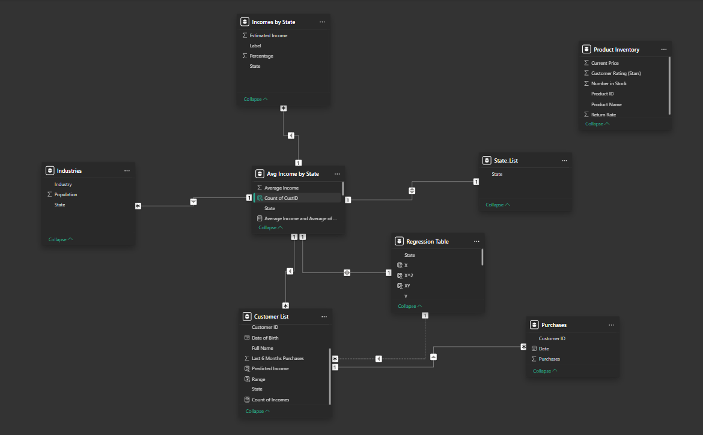
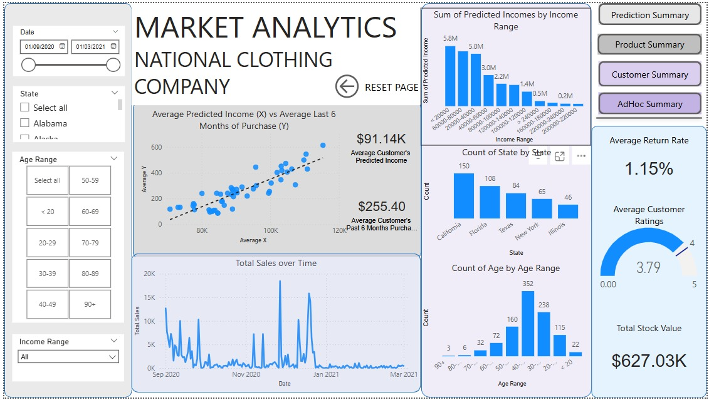
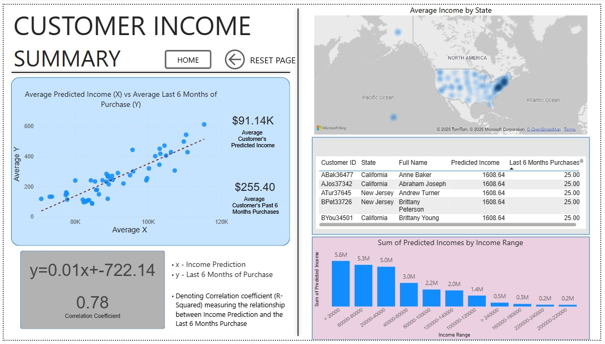
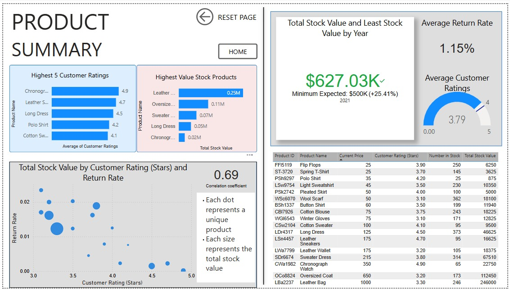
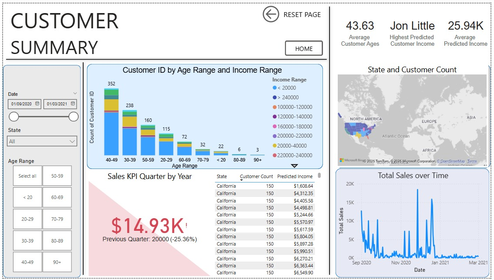

# Analytic Report for National Clothing Company

[Project link](https://app.powerbi.com/view?r=eyJrIjoiZWVmZDliNTQtZjYzNC00NGI2LTlkYmYtZmVjZDZkMzIyZDc1IiwidCI6Ijk2ZDUwZjcyLWE2MGMtNDgwOS1iNGI1LTIwYjQ5NDUxNjFhZSJ9&pageName=63505591280cd50d404d)

This project focuses on leveraging data analytics to generate insights for targeted marketing campaigns. The project addresses historically low customer engagement attributed to limited marketing initiatives, aiming to revive and improve sales through personalized outreach strategies informed by behavioral patterns and purchasing trends.

## Data Sources
* Average Temperatures by State
* Census Data
* Customer List
* Purchase List
* State List

## Analysis Questions
1. What is the correlation (R2 value) between sales and income?
2. What is the correlation (R2 value) between customer ratings and product return rate?
3. What are the linear regression formulas to predict customer income from customer sales?
4. Which customer do you predict has the highest income?
5. Which product will be advertised the most?

## Wrangling
* Used Power Query to split the columns under the Product Inventory table using a delimiter. More transformations such as changing data type, extracting dates and merging columns were used.
* For the Purchase List table, unpivoting all asides the ID column was done to standardize the table

## Visuals
Data Schema 

1. Home

2. Predicted Customer Income Summary

 
3. Products Summary

4. Customer Summary

   
5. AdHoc Analysis

